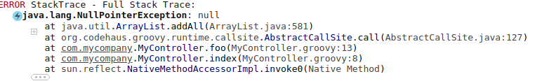
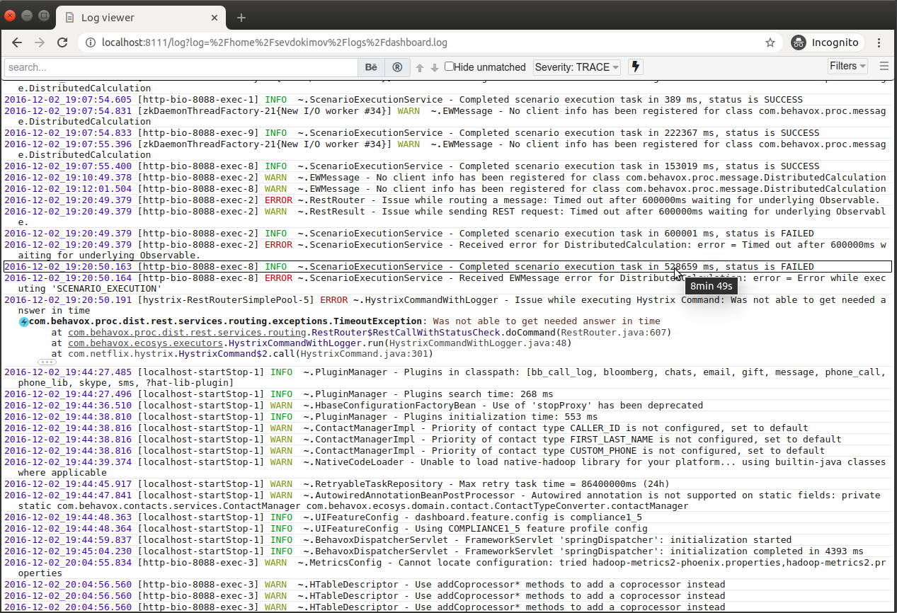

## Log Viewer Grails Plugin
Grails plugin to monitor application logs using web UI. The plugin adds a page showing logs to "/logs" URL.
Location of log files, and their format can be detected automatically. The Log Viewer can show big log files without significant 
resource consumption because it reads only a part of file that user is looking now.

The plugin uses [Log Viewer](https://github.com/sevdokimov/log-viewer) project to showing log. It
can be deployed as a separated application, separated log monitoring application is better than embedded in some cases.  

### Features

1. Highlighting fields, lines, parent brackets. Highlighting makes the log much more readable.
1. Event filtering by a level, logger or a custom condition written on Groovy.
1. Collapsing secondary information like unmeaning parts of exception stacktraces, full name of logger.
1. A permanent link to a log position. User can copy a link to the current position and send it to another user. 

[Demo video](https://www.youtube.com/watch?v=1ukLMIqN0i0)

### Configuration

`log-viewer.url-mapping` - URL to map the log viewer servlet. "/logs/*" is used by default.

`log-viewer.home-package` - A list of java packages where application's source code is located. This list is used to 
render exceptions. Application's classes will be highlighted, other classes will be collapsed. For example, if 
_log-viewer.home-package=com.mycompany,org.mycompany_, a stacktrace will look like

### Screenshot

